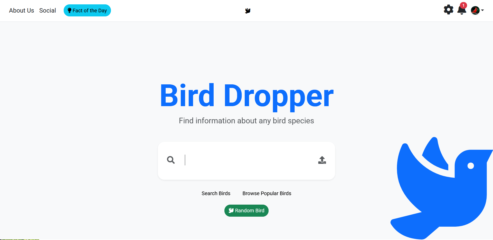

# 🐦 The Bird Dropper: Share Your Sightings, Spread the Joy! 🐦


## 🌟 For the Avid Bird Watcher: Drop Your Discoveries! 🌟

Are you passionate about spotting feathered friends? Do you get a thrill from identifying a rare warbler or a majestic raptor? Then **The Bird Dropper** is the app for you!

Imagine a dedicated space where you can not only keep track of your own incredible bird sightings but also share them with a community of fellow enthusiasts. The Bird Dropper provides an intuitive and engaging platform for bird watchers to:

* **"Drop" Your Birds:** Effortlessly log your sightings, including species, location, and even photos or notes.
* **Build Your Collection:** Create a personal digital birding journal, showcasing your growing list of observed species.
* **Discover Others' Finds:** Explore a vibrant social feed to see what birds others have spotted in your area or around the world.
* **Connect and Share:** Engage with fellow bird watchers by commenting on their posts and sharing your own experiences.
* **Explore Local Hotspots:** Discover new birding locations based on recent sightings shared by the community.

The Bird Dropper isn't just a tracker; it's a thriving environment for bird lovers to connect, learn, and celebrate the beauty of the avian world together.

## 🤝 Contributors

> Aaron Benighaus, Ben Blair, Luke Maschoff, Jonathan Roe, Joshua Trujillo

## 🛠️ Technology Stack

>
> * **Frontend:** JavaScript, HTML, CSS
> * **Backend:** Node.js
> * **Database:** PostgreSQL
> * **Cloud Platform:** Render

## ⚙️ Prerequisites to Run the App

>
> * Node.js, npm, postgresql, docker-compose or docker
> * A SupaBase API key

## 🚀 Instructions on How to Run the App Locally

>
> * First off you'll need to clone the repo:
> ```git clone https://github.com/jotrujil03/bird-dropper.git```
> * Then go to the newly created `bird-dropper` folder, then into the sub-directory `ProjectSourceCode` (or just run the command below):
> ```cd bird-dopper/ProjectSourceCode```
> * Next you'll need to create an `.env` file:
>  ```touch .env```
> * Add these lines to your .env file:
``` POSTGRES_HOST='db'
POSTGRES_DB='users_db'
POSTGRES_USER='postgres'
POSTGRES_PASSWORD='pwd'
SUPABASE_BUCKET=''
SUPABASE_URL=''
SUPABASE_SERVICE_KEY=''
```
> * You'll need to edit one other file. Go to the `/src/init_data` folder and uncomment the `-- \c users_db` line by removing the two dashes in front.
> * Afterwards you should be good to go, so run the command `docker-compose up`, and the rest of the setup should be handled automatically.

## 🧪 How to Run Tests

> The tests are run automatically after local deploy.


## 🔗 Link to the Deployed Application

>
> [Try The Bird Dropper Here!:](https://bird-dropper-web.onrender.com/)

---

**Happy Birding!** 🐦📸
